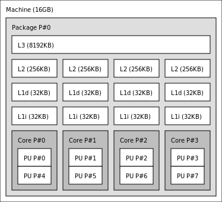
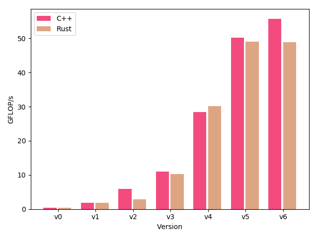
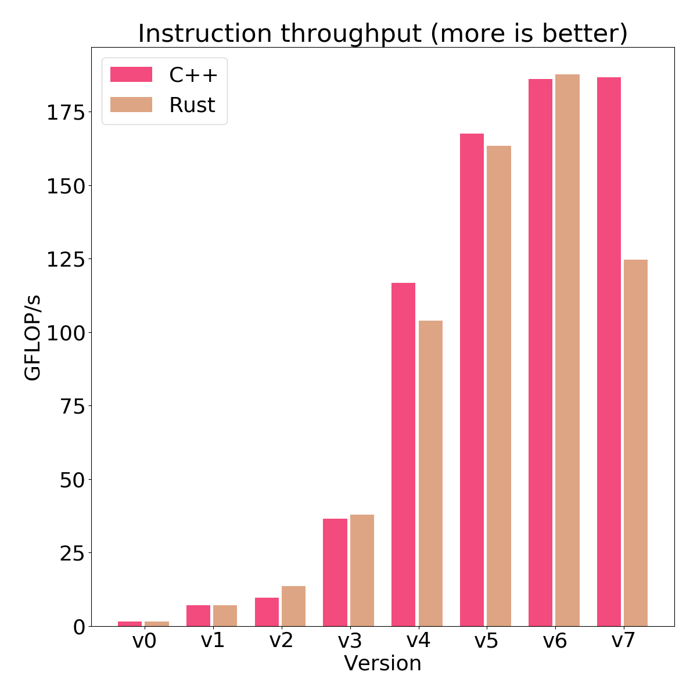

# Rust and C++, a performance comparison

This project compares the behaviour and performance of two solutions to a simple graph problem, called the shortcut problem.
The reference solution, written in C++, and a description of the shortcut problem can be found [here](http://ppc.cs.aalto.fi/ch2/).
The reference solution will be compared to a [Rust](https://github.com/rust-lang/rust) implementation, which is provided by this project.

If you are already familiar with the approach presented by the reference C++ solution, a more thorough explanation of the provided Rust implementation can be found in the [wiki](../../wiki/Introduction).

## The `step` function

The reference solution provides 8 versions of the `step`-function, each containing an incremental improvement, built on top of the previous implementation.

Version | Description
--- | ---
`v0_baseline` | Straightforward solution without preprocessing
`v1_linear_reading` | Create a copy of the input and store its transpose in row-major order, enabling a linear memory access pattern
`v2_instr_level_parallelism` | Break instruction dependency chains, increasing instruction throughput
`v3_simd` | Use vector registers and SIMD instructions explicitly, reducing the amount of required instructions
`v4_register_reuse` | Read vectors in blocks of 6 and do 9+9 arithmetic operations for each block, improving the ratio of operations per memory access
`v5_more_register_reuse` | Reorder input structure by packing the data into SIMD vectors vertically, instead of horizontally. Read the vertically ordered data as vector pairs and do 8+8 arithmetic operations for each pair, further improving the ratio of operations per memory access
`v6_prefetching` | Add prefetch hint instructions to take advantage of vacant CPU execution ports
`v7_cache_reuse` | Add [Z-order curve](https://en.wikipedia.org/wiki/Z-order_curve) memory access pattern, improving data locality from cache reuse

## Benchmark results

### Settings

* Input consists of single precision floating point numbers drawn uniformly at random from [0, 1.0).
* Input size 4000 x 4000 = 16M elements.
* Each benchmark is run with 4 software threads and the benchmark process is bound with [`taskset`](https://linux.die.net/man/1/taskset) to 4 cpus.
* 5 iterations for each `step` version for both languages, i.e. 5 x 7 x 2 runs in total.
* The result metrics are reduced to the arithmetic mean, e.g. mean GFLOP/s of 5 independent runs.

### CPU: Intel Xeon E3-1230 v5 @ 3.4 GHz



### Single thread



### Four threads



Raw CSV data from the benchmark is available [here](reports/Xeon_E3-1230_v5).


## Requirements

This project has been tested only on a 64-bit x86 platform.

This project provides 3 scripts for building, benchmarking and testing the project.
These scripts assume the following executables are available on your path:

* `python3`
* `g++`
* `make`
* `cmake`
* `perf`
* `cargo`
* `rustc`
* `taskset`

You can install and configure both the Rust compiler `rustc` and its package management tool `cargo` by using [rustup](https://github.com/rust-lang-nursery/rustup.rs).

If you use the rustup script, choose `2) Customize installation`, change the default toolchain to `nightly`, and continue installation.

If you installed the `rustup` binary e.g. by using a system package manager:
```
rustup install nightly
rustup default nightly
rustup update
```

## Running

If all prerequisites have been installed, you can build, test and benchmark everything with [`do_csv_bench.bash`](do_csv_bench.bash).
See the script for details.

### Building

Build all libraries with parallel execution capabilities:
```
./build.py --verbose
```
Assuming all dependencies have been installed, this will create an out of source build into the directory `./build`.
All executables for testing each version of the `step` function are in the `build/bin` directory.

To build purely serial versions of all libraries:
```
./build.py --verbose --no-multi-thread
```

### Testing

Test all implementations against the C++ v0 baseline implementation:
```
./test.py
```

### Benchmarking

Run all implementations for 5 iterations, each with random input containing 4000 rows and 4000 columns, writing results in csv format into `./reports`:
```
./bench.py --reporter_out csv --report_dir reports --iterations 5 -n 8 -m 9
```
For more info:
```
./bench.py --help
```
