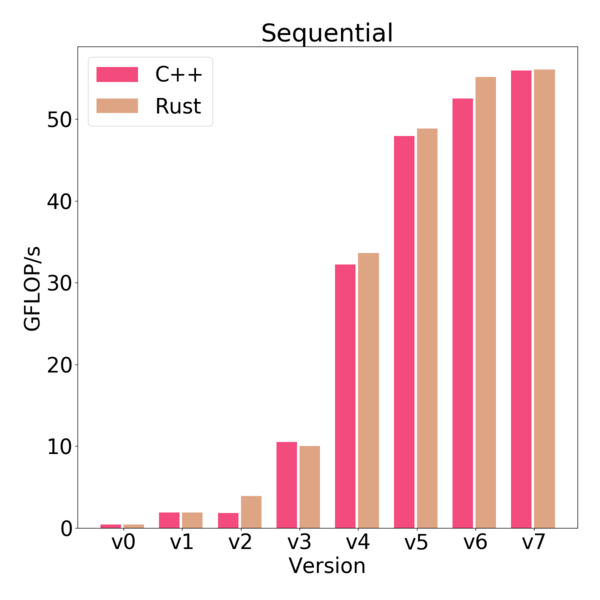
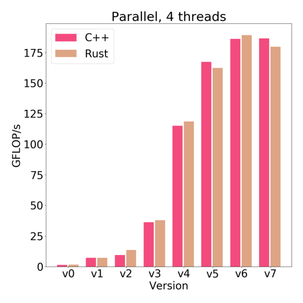

# Rust and C++, a performance comparison

This project compares the behaviour and performance of two solutions to a simple graph problem, called the shortcut problem.
The reference solution, written in C++, and a description of the shortcut problem can be found [here](http://ppc.cs.aalto.fi/ch2/).
The reference solution will be compared to a [Rust](https://github.com/rust-lang/rust) implementation, which is provided by this project.

The wiki is being revised and will be available later.

## Benchmark results

### CPU: Intel Xeon E3-1230 v5 @ 3.4 GHz

